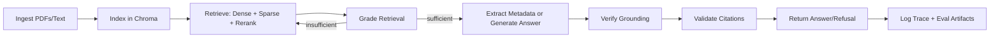
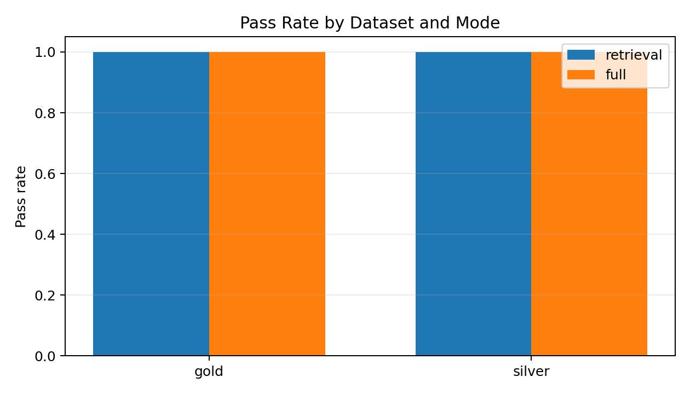
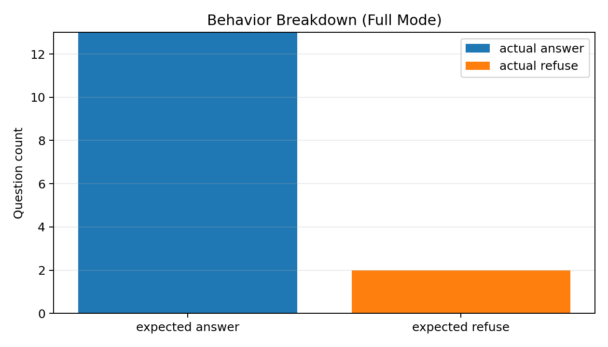
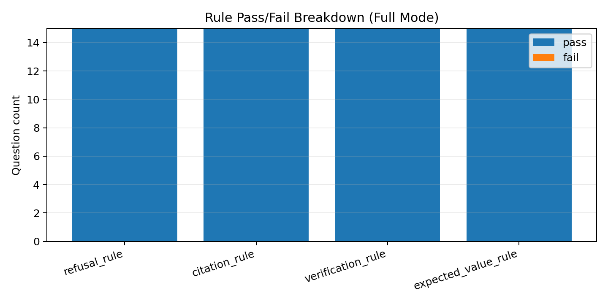
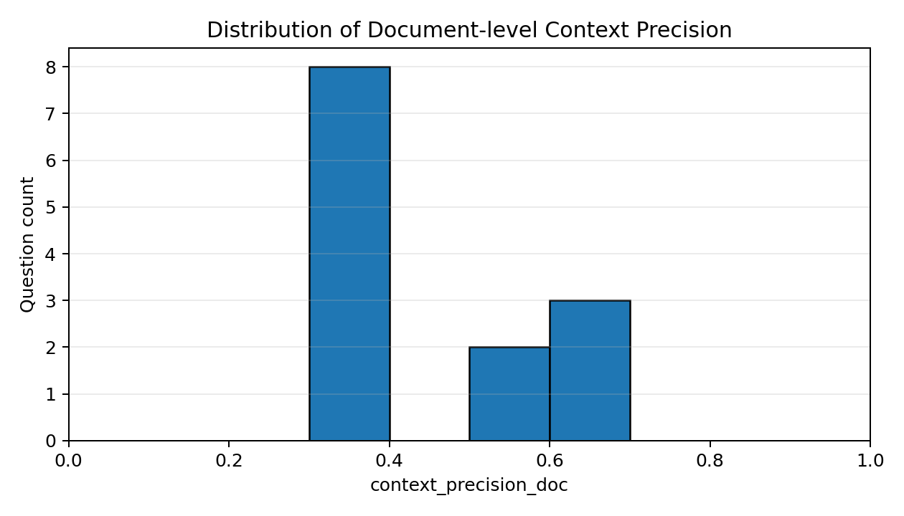

# Verified Agentic RAG for Public-Sector Policy Packs

A reliability-first agentic RAG mini-product for grounded Q&A over public employee policy documents, with strict citations, refusal behavior, and evidence-based evaluation.

## What Problem This Solves

This project answers questions over the Saltash Town Council employee policy pack (Cornwall, UK) while enforcing:
- grounded answers only from repository evidence,
- exact citation labels (`file:start-end`),
- refusal when evidence is missing or out-of-scope.

It is designed as a mini-product benchmark for trustworthy policy QA, not just a demo chatbot.

## Key Features

- PDF-to-text ingestion for policy pack documents.
- Line-aware chunking with metadata/header prioritization.
- Hybrid retrieval (dense + sparse fusion) plus reranking.
- Metadata-first deterministic extraction for policy header fields.
- Agentic retrieval refinement loop when first-pass context is weak.
- Strict citation validation and citation-evidence overlap checks.
- Post-answer groundedness verification gate.
- Gold/Silver evaluation suite with evidence-based retrieval + answer metrics.

## Architecture Overview



## Quickstart

### 1) Setup

```bash
python -m venv .venv
# Windows
.venv\Scripts\activate
# Linux/macOS
# source .venv/bin/activate

pip install -r requirements.txt
pip install -e .
```

### 2) Download/refresh policy corpus

```bash
python scripts/download_policy_pack.py --refresh-text
```

### 3) Build index

```bash
varag-ingest --reset --scope docs
```

### 4) Ask a question

```bash
varag-chat "What is the responsible committee for the Data Protection Policy - Employees?"
```

### 5) Run evaluation suites

```bash
varag-eval --mode retrieval --output-path reports/samples/eval_results_suite_retrieval_post_upgrade.json
varag-eval --mode full --output-path reports/samples/eval_results_suite_full_post_upgrade.json
```

### 6) Generate charts

```bash
python scripts/generate_report_figures.py \
  --csv-path reports/full_system_eval_question_results_20260212.csv \
  --output-dir reports/figures
```

### 7) Run tests

```bash
pytest -q
```

## Evaluation Methodology

### Gold vs Silver

- `evalset/gold.jsonl`: human-verified benchmark for strict reporting/gating.
- `evalset/silver.jsonl`: broader weak-label regression coverage for drift detection.

### Modes

- Retrieval mode: evaluates evidence retrieval quality without LLM answer generation.
- Full mode: evaluates end-to-end behavior (answer/refuse, citations, verification).

### Core Metrics

- `pass_overall`: strict final gate across required rules.
- `evidence_recall_at_k`: whether retrieved chunks include required evidence.
- `evidence_mrr`: rank quality of the first relevant evidence hit.
- `evidence_ndcg_at_k`: ranking quality normalized to `[0,1]`.
- `verification_passed`: groundedness/faithfulness gate result.

## Latest Results (Post-Upgrade)

Source artifacts:
- `reports/samples/eval_results_suite_retrieval_post_upgrade.json`
- `reports/samples/eval_results_suite_full_post_upgrade.json`
- `reports/full_system_eval_question_results_20260212.csv`

| Dataset | Retrieval Mode | Full Mode |
|---|---:|---:|
| Gold | 4/4 (100%) | 4/4 (100%) |
| Silver | 11/11 (100%) | 11/11 (100%) |

Additional verified indicators on current tiers:
- Refusal correctness: passing.
- Citation validity: passing.
- Citation overlap with gold evidence: passing.
- Verification (faithfulness gate): passing.
- Test suite: `36/36` passing.

Showcase figures:
- `reports/figures/pass_rate_by_dataset_mode.png`
- `reports/figures/behavior_confusion_full_mode.png`
- `reports/figures/rule_pass_breakdown_full_mode.png`
- `reports/figures/context_precision_distribution.png`






Limitation note:
- Current gold set is still small (4 items). Expand with more narrative/procedural and multi-chunk questions before making broad generalization claims.

## Repo Structure

```text
verified-agentic-rag/
  src/verified_agentic_rag/
    agentic.py
    evals.py
    retrieve.py
    policy_fields.py
    ...
  tests/
  scripts/
    download_policy_pack.py
    generate_silver_evalset.py
    generate_report_figures.py
  evalset/
    gold.jsonl
    silver.jsonl
    SCHEMA.md
  reports/
    figures/
    samples/
    full_system_evaluation_report_20260212.md
    full_system_eval_question_results_20260212.csv
    RESULTS.md
  docs/legacy/
  data/   # runtime only (gitignored except keepers)
  pyproject.toml
  requirements.txt
```

## Roadmap

- Expand gold benchmark with narrative and multi-hop policy questions.
- Add section-aware chunking tuned for policy tables and status sections.
- Add answer synthesis regression tests (style + citation alignment).
- Add richer retrieval diagnostics (before/after rerank deltas in reports).
- Add a lightweight UI demo for policy analysts.
- Add periodic benchmark snapshots with versioned result packs.

## License and Data Provenance

- License: no explicit OSS license file is currently included in this repository.
- Data provenance: corpus documents are public-sector policy content from Saltash Town Council policy pages and linked PDFs. Keep source URLs and timestamps in reports when publishing benchmark claims.
